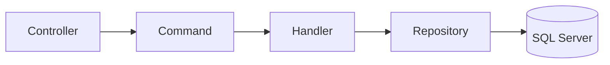
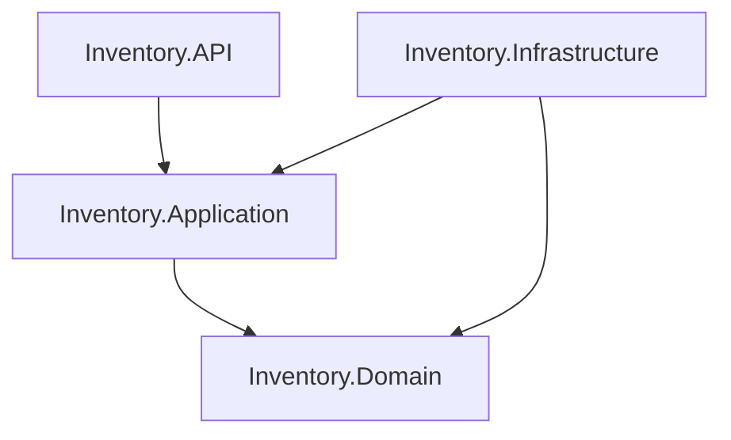

# Inventory System API


---

## 📝 Description

Inventory System API is a high-performance backend built with .NET 8 using Clean Architecture and CQRS principles.

The project provides scalable inventory management features including authentication, product tracking, warehouse management, purchase orders, sales orders, and inventory movements.

---

## ⚡ Tech Stack

<p align="left">
  
</p>

---

## 🏗️ Architecture

* Clean Architecture
* CQRS Pattern
* Repository Pattern
* Dependency Injection
* JWT Authentication
* FluentValidation Pipeline
* MediatR Request Handling
* AutoMapper Object Mapping

---

## 🔄 CQRS Flow



---

## 🛠️ Technologies

* ASP.NET Core 8
* Entity Framework Core
* SQL Server
* MediatR
* FluentValidation
* AutoMapper
* Serilog
* Swagger / OpenAPI
* JWT Authentication

---

## ✨ Features

* 🔐 JWT Authentication & Authorization
* 📦 Product Management
* 🏷️ Category Management
* 🏭 Warehouse Management
* 📊 Inventory Tracking
* 🛒 Purchase Orders
* 💰 Sales Orders
* ✅ FluentValidation Pipeline
* 📜 Serilog Request Logging
* ⚡ CQRS with MediatR

---

## 📁 Project Structure

```bash
src/
├── Inventory.API
├── Inventory.Application
├── Inventory.Domain
└── Inventory.Infrastructure
```

<details>
<summary>📂 Full Project Structure</summary>

```bash
Inventory_System
├── Inventory_System.sln
└── src
    ├── Inventory.API
    │   ├── Common
    │   │   └── ApiRoutes.cs
    │   ├── Controllers
    │   │   ├── AuthController.cs
    │   │   ├── CategoriesController.cs
    │   │   ├── InventoryController.cs
    │   │   ├── ProductsController.cs
    │   │   ├── PurchaseOrdersController.cs
    │   │   ├── SalesOrdersController.cs
    │   │   └── WeatherForecastController.cs
    │   ├── Dockerfile
    │   ├── Extensions
    │   │   ├── ApplicationBuilderExtensions.cs
    │   │   ├── AuthenticationExtensions.cs
    │   │   ├── ServiceCollectionExtensions.cs
    │   │   └── SwaggerExtensions.cs
    │   ├── Filters
    │   │   └── ValidationFilter.cs
    │   ├── Inventory.API.csproj
    │   ├── Inventory.API.http
    │   ├── Middlewares
    │   │   ├── ExceptionHandlingMiddleware.cs
    │   │   ├── ExceptionMiddleware.cs
    │   │   └── RequestLoggingMiddleware.cs
    │   ├── Program.cs
    │   ├── Properties
    │   │   └── launchSettings.json
    │   ├── WeatherForecast.cs
    │   └── appsettings.json
    ├── Inventory.Application
    │   ├── Behaviors
    │   │   ├── LoggingBehavior.cs
    │   │   ├── PerformanceBehavior.cs
    │   │   └── ValidationBehavior.cs
    │   ├── Common
    │   │   ├── Behaviors
    │   │   │   └── ValidationBehavior.cs
    │   │   ├── Exceptions
    │   │   │   ├── NotFoundException.cs
    │   │   │   ├── UnauthorizedException.cs
    │   │   │   └── ValidationException.cs
    │   │   └── Models
    │   │       ├── PagedResult.cs
    │   │       └── Result.cs
    │   ├── DependencyInjection.cs
    │   ├── Features
    │   │   ├── Auth
    │   │   │   ├── Commands
    │   │   │   │   └── Login
    │   │   │   │       ├── LoginCommand.cs
    │   │   │   │       ├── LoginCommandHandler.cs
    │   │   │   │       └── LoginCommandValidator.cs
    │   │   │   └── DTOs
    │   │   │       ├── AuthResponseDto.cs
    │   │   │       └── LoginRequestDto.cs
    │   │   ├── Categories
    │   │   │   ├── Commands
    │   │   │   │   └── CreateCategory
    │   │   │   │       ├── CreateCategoryCommand.cs
    │   │   │   │       ├── CreateCategoryCommandHandler.cs
    │   │   │   │       └── CreateCategoryCommandValidator.cs
    │   │   │   ├── DTOs
    │   │   │   │   └── CategoryDto.cs
    │   │   │   └── Queries
    │   │   │       └── GetCategories
    │   │   │           ├── GetCategoriesQuery.cs
    │   │   │           └── GetCategoriesQueryHandler.cs
    │   │   ├── Inventory
    │   │   │   └── Commands
    │   │   │       └── CreateInventoryMovement
    │   │   │           ├── CreateInventoryMovementCommand.cs
    │   │   │           ├── CreateInventoryMovementCommandHandler.cs
    │   │   │           └── CreateInventoryMovementCommandValidator.cs
    │   │   ├── Products
    │   │   │   ├── Commands
    │   │   │   │   ├── CreateProduct
    │   │   │   │   │   ├── CreateProductCommand.cs
    │   │   │   │   │   ├── CreateProductCommandHandler.cs
    │   │   │   │   │   └── CreateProductCommandValidator.cs
    │   │   │   │   └── UpdateProduct
    │   │   │   │       └── UpdateProductCommand.cs
    │   │   │   ├── DTOs
    │   │   │   │   ├── CreateProductRequestDto.cs
    │   │   │   │   ├── ProductDto.cs
    │   │   │   │   └── UpdateProductRequestDto.cs
    │   │   │   ├── Mappings
    │   │   │   │   └── ProductMappingProfile.cs
    │   │   │   └── Queries
    │   │   │       └── GetProducts
    │   │   │           ├── GetProductsQuery.cs
    │   │   │           └── GetProductsQueryHandler.cs
    │   │   └── Warehouses
    │   │       ├── Commands
    │   │       │   └── CreateWarehouse
    │   │       │       ├── CreateWarehouseCommand.cs
    │   │       │       ├── CreateWarehouseCommandHandler.cs
    │   │       │       └── CreateWarehouseCommandValidator.cs
    │   │       └── Queries
    │   │           └── GetWarehouses
    │   │               ├── GetWarehousesQuery.cs
    │   │               └── GetWarehousesQueryHandler.cs
    │   ├── Interfaces
    │   │   ├── Persistence
    │   │   │   ├── IApplicationDbContext.cs
    │   │   │   └── IUnitOfWork.cs
    │   │   └── Services
    │   │       ├── ICurrentUserService.cs
    │   │       ├── IDateTimeProvider.cs
    │   │       └── IJwtService.cs
    │   └── Inventory.Application.csproj
    ├── Inventory.Domain
    │   ├── Common
    │   │   ├── AuditableEntity.cs
    │   │   └── BaseEntity.cs
    │   ├── Entities
    │   │   ├── AuditLog.cs
    │   │   ├── Category.cs
    │   │   ├── Customer.cs
    │   │   ├── InventoryMovement.cs
    │   │   ├── Product.cs
    │   │   ├── PurchaseOrder.cs
    │   │   ├── PurchaseOrderItem.cs
    │   │   ├── Role.cs
    │   │   ├── SalesOrder.cs
    │   │   ├── SalesOrderItem.cs
    │   │   ├── Supplier.cs
    │   │   ├── User.cs
    │   │   └── Warehouse.cs
    │   ├── Enums
    │   │   ├── MovementType.cs
    │   │   └── OrderStatus.cs
    │   ├── Interfaces
    │   │   └── Repositories
    │   │       ├── ICategoryRepository.cs
    │   │       ├── IInventoryMovementRepository.cs
    │   │       ├── IProductRepository.cs
    │   │       ├── IUserRepository.cs
    │   │       └── IWarehouseRepository.cs
    │   ├── Inventory.Domain.csproj
    │   └── ValueObjects
    │       └── Money.cs
    └── Inventory.Infrastructure
        ├── Authentication
        │   ├── JwtService.cs
        │   └── JwtSettings.cs
        ├── DependencyInjection.cs
        ├── Inventory.Infrastructure.csproj
        ├── Logging
        │   └── SerilogConfiguration.cs
        ├── Persistence
        │   ├── Configurations
        │   │   ├── CategoryConfiguration.cs
        │   │   ├── InventoryMovementConfiguration.cs
        │   │   ├── ProductConfiguration.cs
        │   │   ├── RoleConfiguration.cs
        │   │   └── UserConfiguration.cs
        │   ├── Context
        │   │   └── ApplicationDbContext.cs
        │   └── Repositories
        │       ├── CategoryRepository.cs
        │       ├── ProductRepository.cs
        │       ├── PurchaseOrderRepository.cs
        │       ├── SalesOrderRepository.cs
        │       └── UserRepository.cs
        └── Services
            ├── CurrentUserService.cs
            └── DateTimeProvider.cs

```

</details>

---

## 🏛️ Clean Architecture Diagram



---

## 📸 Entity Relationship Diagram

<p align="center">
  
</p>

---

## 📦 Key Dependencies

| Package                                             | Version |
| --------------------------------------------------- | ------- |
| MediatR                                             | 12.2.0  |
| FluentValidation.AspNetCore                         | 11.3.0  |
| AutoMapper.Extensions.Microsoft.DependencyInjection | 12.0.1  |
| Microsoft.EntityFrameworkCore                       | 8.0.5   |
| Microsoft.EntityFrameworkCore.SqlServer             | 8.0.5   |
| Microsoft.EntityFrameworkCore.Tools                 | 8.0.5   |
| Microsoft.AspNetCore.Authentication.JwtBearer       | 8.0.5   |
| BCrypt.Net-Next                                     | 4.0.3   |
| Swashbuckle.AspNetCore                              | 6.6.2   |
| Serilog.AspNetCore                                  | 8.0.1   |

---

## 🚀 Getting Started

### 1️⃣ Clone Repository

```bash
git clone https://github.com/your-user/Inventory_System.git
```

---

### 2️⃣ Navigate to Project

```bash
cd Inventory_System
```

---

### 3️⃣ Restore Dependencies

```bash
dotnet restore
```

---

### 4️⃣ Build Project

```bash
dotnet build
```

---

### 5️⃣ Run API

```bash
dotnet run --project src/Inventory.API
```

---

## 🔑 JWT Configuration

Update your `appsettings.json` file:

```json
"JwtSettings": {
  "SecretKey": "YOUR_SECRET_KEY",
  "Issuer": "InventoryAPI",
  "Audience": "InventoryClient",
  "ExpirationInMinutes": 120
}
```

---

## 📘 API Documentation

Swagger UI will be available at:

```bash
https://localhost:xxxx/swagger
```

---

## 📌 Future Improvements

* Docker Compose support
* Refresh Tokens
* Unit Testing
* Integration Testing
* Role-Based Authorization
* Redis Caching
* Background Jobs
* CI/CD Pipeline

---

## 👨‍💻 Author

Raul Espinoza  
.NET Backend Developer

- ASP.NET Core
- Clean Architecture
- CQRS
- Entity Framework Core
- SQL Server
